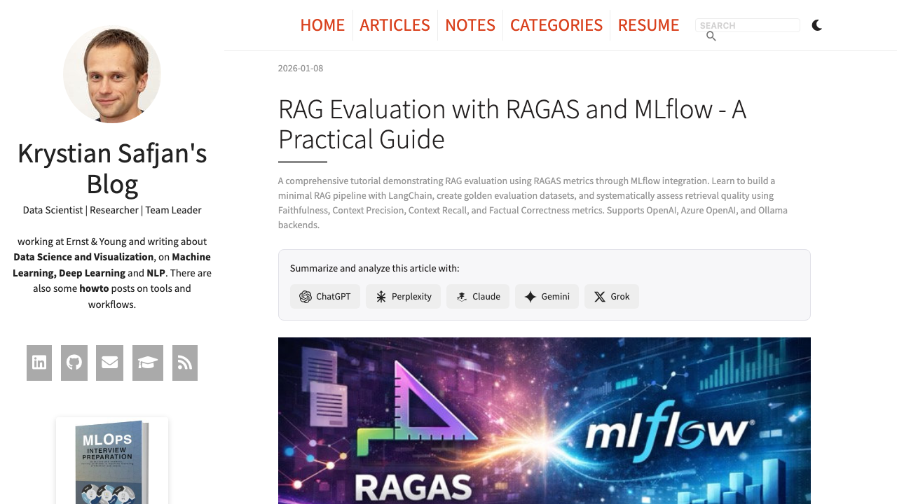

# Pelican AI Analyzer Bar

A Pelican plugin that adds clickable AI service buttons to your articles, allowing readers to analyze and summarize content with one click using ChatGPT, Perplexity, Claude, Gemini, or Grok.



## Installation

```bash
pip install pelican-ai-analyzer-bar
```

Or install from source:

```bash
pip install -e /path/to/pelican-ai-analyzer-bar
```

## Configuration

Add to your `pelicanconf.py`:

```python
PLUGINS = [
    # ... other plugins
    'pelican_ai_analyzer_bar',
]

AI_ANALYZER_BAR = {
    'enabled': True,
    'services': ['chatgpt', 'perplexity', 'claude', 'gemini', 'grok'],
    'position': 'after_header',  # 'after_header', 'after_summary', or 'both'
    'text': 'Summarize and analyze this article with:',
    'exclude_categories': ['note', 'til'],
    'exclude_paths': [],
}
```

### Configuration Options

| Option | Type | Default | Description |
|--------|------|---------|-------------|
| `enabled` | bool | `True` | Enable/disable the plugin globally |
| `services` | list | All 5 services | Which AI services to show |
| `position` | str | `'after_header'` | Where to display the bar |
| `text` | str | `'Summarize and analyze this article with:'` | Text shown before buttons |
| `exclude_categories` | list | `[]` | Categories to exclude |
| `exclude_paths` | list | `[]` | URL paths to exclude |

### Available Services

- `chatgpt` - OpenAI ChatGPT
- `perplexity` - Perplexity AI
- `claude` - Anthropic Claude
- `gemini` - Google Gemini
- `grok` - xAI Grok

## Per-Article Control

Disable the bar for a specific article using frontmatter:

```markdown
Title: My Article
ai_analyzer_bar: false

Content here...
```

## Theme Integration

The plugin adds `ai_analyzer_bar_html` and `ai_analyzer_bar_position` attributes to each article. Your theme's `article.html` template needs to render this HTML.

### Basic Usage

Add this snippet to your theme's `article.html` where you want the bar to appear:

```jinja2

<div class="ai-analyzer-bar">
    {{ article.ai_analyzer_bar_html|safe }}
</div>

```

### Placement Options

Choose where to place the snippet in your `article.html`:

| Position | Location in Template | Description |
|----------|---------------------|-------------|
| Before title | Before `<h1>{{ article.title }}</h1>` | Bar appears at very top |
| After title | After the `<h1>` tag | Below title, above metadata |
| After metadata | After date/author info | Below metadata, above summary |
| After summary | After `{{ article.summary }}` | Below summary, above content |
| After content | After `{{ article.content }}` | At the bottom of article |

### Position-Aware Integration

For themes that support multiple positions via the `position` config option:

```jinja2
{# Create a reusable partial or add directly #}


    
    
    <div class="ai-analyzer-bar">
        {{ article.ai_analyzer_bar_html|safe }}
    </div>
    



{# Then call where needed: #}
{{ ai_bar('after_header') }}
{{ ai_bar('after_summary') }}
```

### Required CSS

Add these styles to your theme's stylesheet:

```css
.ai-analyzer-bar {
  margin: 1.5rem 0;
  padding: 1rem;
  background-color: #f7f7f9;
  border: 1px solid #e1e1e8;
  border-radius: 8px;
}

.ai-analyzer-bar-inner {
  display: flex;
  flex-direction: column;
  gap: 0.75rem;
}

.ai-analyzer-text {
  font-size: 0.9rem;
  font-weight: 500;
}

.ai-analyzer-buttons {
  display: flex;
  flex-wrap: wrap;
  gap: 0.5rem;
}

.ai-analyzer-btn {
  display: inline-flex;
  align-items: center;
  gap: 0.4rem;
  padding: 0.4rem 0.75rem;
  background-color: #eee;
  border-radius: 6px;
  text-decoration: none;
  font-size: 0.85rem;
  transition: all 0.2s ease;
}

.ai-analyzer-btn:hover {
  transform: translateY(-1px);
}

.ai-analyzer-icon {
  display: inline-flex;
  width: 18px;
  height: 18px;
}

.ai-analyzer-icon svg {
  width: 100%;
  height: 100%;
}

.ai-analyzer-name {
  font-weight: 500;
}

/* Service-specific hover colors */
.ai-analyzer-chatgpt:hover { background-color: #10a37f; color: white; }
.ai-analyzer-perplexity:hover { background-color: #1a1a2e; color: white; }
.ai-analyzer-claude:hover { background-color: #cc785c; color: white; }
.ai-analyzer-gemini:hover { background-color: #4285f4; color: white; }
.ai-analyzer-grok:hover { background-color: #000000; color: white; }
```

## License

MIT License
